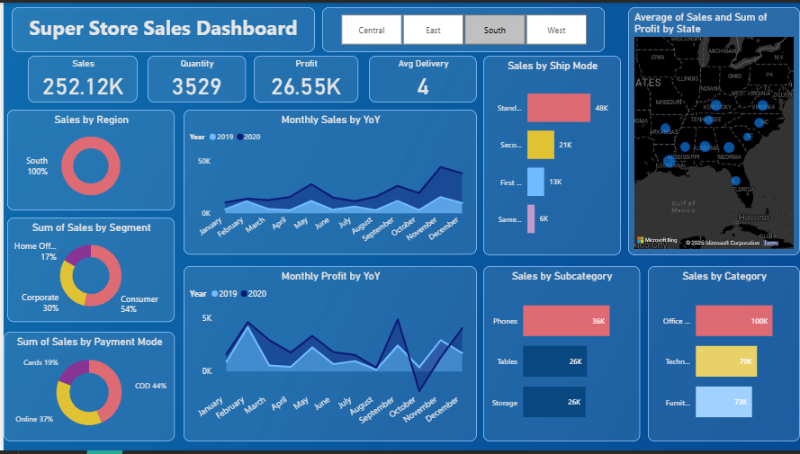
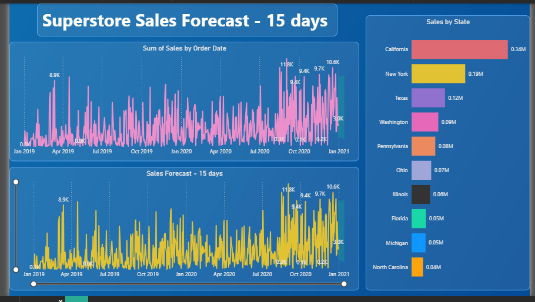

# 🏪 Superstore Sales Analysis & Forecasting Dashboard (Power BI)

## 📊 Project Overview
This Power BI project analyzes retail sales performance and forecasts revenue for the next **15 days** using Power BI's built-in time series forecasting feature.  
It provides insights into regional sales, category-wise performance, payment methods, and delivery metrics.

---

## 🚀 Features
- Interactive **Power BI Dashboard**
- **15-day Sales Forecasting** using built-in analytics
- KPIs: Total Sales, Profit, Quantity, and Average Delivery
- Year-over-Year (YoY) Sales & Profit Trends
- Region, Segment, and Category-level breakdowns
- Dynamic filters and slicers for exploration

---

## 🧠 Tools & Skills Used
- **Power BI** (Data Cleaning, Modeling, Visualization, Forecasting)
- **Data Analysis** (Time Series, KPI Design, Storytelling)
- **Dataset:** Superstore Sales Data (2019–2020)

---

## 📈 Dashboard Preview
### Main Dashboard

### 15-Day Forecast

---

## 📂 Files in Repository
| File | Description |
|------|--------------|
| `Superstore_Sales_Forecast.pbix` | Power BI dashboard file |
| `sample_sales_data.csv` | Sample dataset |
| `README.md` | Project documentation |

---

## 👩‍💻 Author
**Ankita Banubakode**  
[LinkedIn Profile](www.linkedin.com/in/ankita-banu) • [Email](mailto:banubakodeankita@gmail.com)

#powerbi #dataanalysis #forecasting #dashboard #timeseries #retailanalytics

